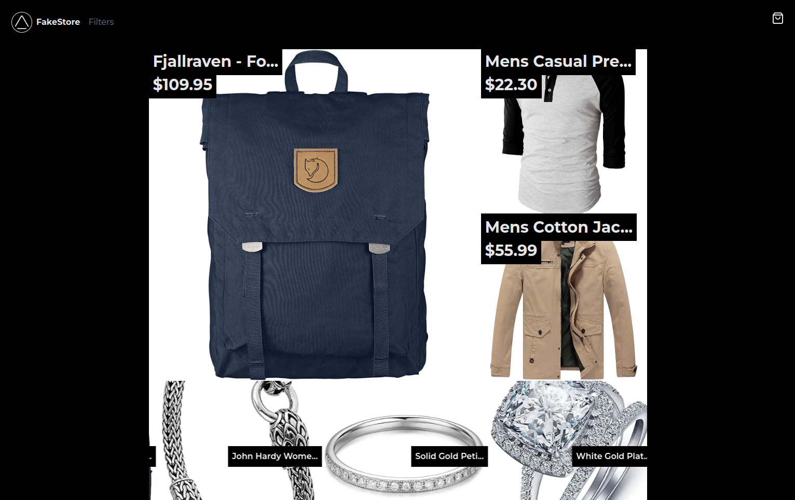

# 🛍️ FakeStore

<p align="center">
  <a href="#-description">Description</a>&nbsp;|&nbsp;
  <a href="#-deploy">Deploy</a>&nbsp;|&nbsp;
  <a href="#-tech-stack">Tech Stack</a>&nbsp;|&nbsp;
  <a href="#-environment-variables">Environment Variables</a>&nbsp;|&nbsp;
  <a href="#-functionality">Functionality</a>&nbsp;|&nbsp;
  <a href="#-install-and-scripts">Install & Scripts</a>&nbsp;|&nbsp;
  <a href="#-contribution">Contribution</a>&nbsp;|&nbsp;
  <a href="#-license">License</a>
</p>

<br>

<p align="center">
  
</p>


## 📙 Description

FakeStore is an e-commerce web application that allows users to add products to a virtual shopping cart. Upon opening the cart, users can add, remove and clear products in the cart. 

Checkout was not a part of the scope.

This web app utilizes the [Fake Store API](https://fakestoreapi.com/docs).


## 💻 Deploy

- [Click here](https://next-fakestore.vercel.app/) to go to a Vercel deploy of this app


## 🛠 Tech Stack

- Next
    - appDir
        - App Router
    - TypeScript
    - Context API
- Chakra UI
- Tailwind
    - Classnames
- ESLint + Prettier
    - Airbnb TypeScript Style Guidelines


## ⚙️ Functionality

- View a specific product details
- Add, remove and clear products in the cart
- Filter products by category


## 🔢 Environment Variables

Theres no need to set environment variables for this project


## 👨‍💻 Install and Scripts

Install dependecies on NPM:
```bash
  npm install
```

Run local server:
```bash
  npm run dev
```
Format files with Airbnb JavaScript Style Guidelines:
```bash
  npm run format
```

Create build for deploying:
```bash
  npm run build
```


## 👥 Contribution

If you'd like to contribute with to project, simply open up a Pull Request.


## 🔑 License

[MIT](https://choosealicense.com/licenses/mit/)

